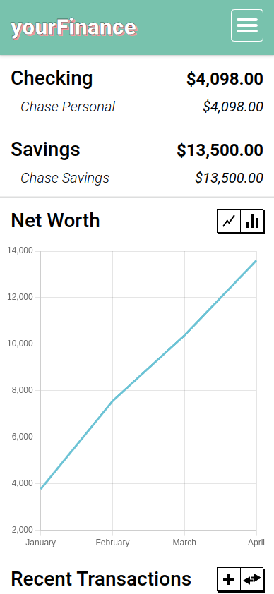
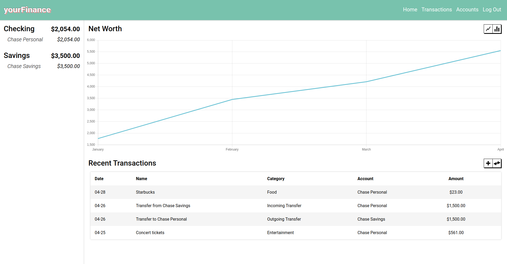
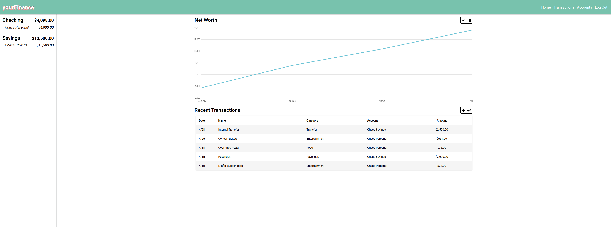

# yourFinance

yourFinance is a personal financial tracker designed to provide a seamless and user-friendly experience for expense & income tracking. The project is built using a diverse tech stack, including HTML, CSS, JavaScript, Python, Flask, SQLAlchemy, and Git.

## Table of Contents
- [Features](#features)
- [Tech Stack](#tech-stack)
- [Responsive Design](#responsive-design)
- [Usage](#usage)

## Features

- **User-Friendly Interface:** The front-end of yourFinance is crafted with HTML, CSS, and JavaScript to ensure an intuitive and visually appealing user interface for efficient expense tracking.

- **Robust Back-End Development:** Leveraging Flask and Python, yourFinance implements robust routes and views on the back-end, providing seamless data management for a reliable user experience.

- **Structured Data Storage:** Integration of SQLAlchemy ensures efficient and structured data storage, enhancing the overall reliability and performance of the application.

- **Version Control with Git:** The project is managed using Git, allowing for collaborative development and streamlined codebase maintenance.

- **Continuous Improvement:** yourFinance is an ongoing project with a focus on continuous improvement, aiming to deliver user-centric financial tracking experiences through regular updates and enhancements.

## Tech Stack

- Front-End: HTML, CSS, JavaScript
- Back-End: Python, Flask
- Database: SQLAlchemy
- Version Control: Git

## Responsive Design

yourFinance is designed to be responsive, providing an optimal user experience across various devices.

### Mobile View

### Desktop Screen

### Wide Screen

## Usage

Visit [yourFinance.com](rafa1510.pythonanywhere.com) to access the live version of the application. Create an account or log in as a guest, and explore the user-friendly interface for expense & income tracking. Add or delete transactions as needed. Tip: Click an account or transaction in their respective page to edit it!